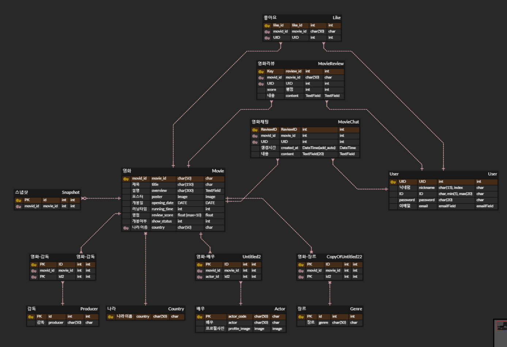

# Final_ PJT : 다각화
영화 추천 사이트🎬

## 팀원 정보

- 팀장 : 김동현
  - 프로젝트 전체 기획, 디자인 설계 및 목업 제작. Vue3를 통한 컴포넌트 프론트엔드 컴포넌트 설계 및 제작. CSS, JS 작업 등 화면 구성 및 효과를 담당.
- 팀원 : 장효승
  - django 백엔드 및 백엔드 api 제작. ERD 설계 및 영화 데이터 저장을 담당. Vue3를 통해 영화 추천 알고리즘 및 주요 기능 제작.

 
## 프로젝트 기획
- 핵심 주제 : 다양한 각도에서 영화를 추천하는 서비스. 원하는 장르, 국가, 배우, 영화감독을 선택하여 조건에 맞는 영화를 추천.

## 설계 내용

### 컴포넌트 설계
- App : 네비게이션바, 템플릿, 폰트 등 프로젝트의 기반을 위한 컴포넌트
- HomeView : 메인 화면 출력. (현재, 예정) 영화 목록을 모두 출력. 영화 추천 기능으로 이동 가능
- MovieDetailView : 영화의 상세정보 페이지(제목, 설명, 포스터 큰화면, 유튜브 예고편)
    - OverviewView : 영화 설명란
    - ReviewView : 영화 리뷰 작성 + 평점 등록 및 공유
    - RecommendView : 관련 영화를 추천하는 페이지
    - ChatView : 영화에 대해 자유롭게 소통할 수 있는 채팅방 (각 영화마다 독립적으로 존재)
- ChoiceView : 영화 추천 기능을 담당하는 페이지. 장르, 국가, 배우, 감독을 선택하여 영화를 추천받음
    - ChoiceDetail : 최종적인 영화 추천 결과 출력
- SearchView : 검색에 대한 결과를 출력하는 페이지
- ProfileView : 유저의 프로필 정보 페이지
    - LikeView : 유저의 좋아요, 리뷰 작성에 대한 정보 출력
    - UpdateView : 회원정보 수정을 위한 페이지. 비밀번호 변경, 닉네임 변경, 회원 탈퇴가 가능

### 구현 정도
- 핵심 기능인 영화 추천 기능에 대해서는 설계한대로 구현하였다.
- 유저 프로필기능에 대해서는 수정이 있었다.
  - 프로필 이미지 설정 기능이 필요성이 낮다고 생각하여 제외했다.
- 처음에 미처 고려하지 못했지만, 영화 검색기능이 필요하다고 생각하여 추가했다.
- 영화 목록, 영화 상세페이지, 리뷰, 채팅 기능에 대해서는 설계와 변경 없이 계획대로 구현했다.

## 데이터베이스 모델링

### ERD

## 영화 추천 알고리즘
- 사용자의 입력으로 장르, 국가, 출연 배우, 영화 감독에 대한 정보를 입력받는다. 입력 받은 데이터에 한해서 각 정보로 영화를 필터링하고, 필터링 한 결과를 리스트로 사용자에게 제공한다.  
- 유저가 정보를 일부만 입력한다면, 입력받은 데이터에 한해서만 필터링을 진행하여 제공한다.
- 필터링이 끝난 영화 목록은 영화 API에서 제공하는 평점 순서로 내림차순 정렬하여 제공된다.

## 핵심 기능에 대한 설명
- 핵심 기능은 영화 추천 기능과, 영화 상세정보 제공 기능이다.
- 영화 추천 기능이 동작하는 원리는 다음과 같다. DB에 존재하는 모든 영화 정보를 불러온 후, 사용자의 입력에 따라 영화가 필터링 된다. 그 후 필터링 된 영화를 기준으로 나라, 배우, 감독 목록을 필터링해서 표시한다.
- 이를 통해 사용자는 많은 배우, 감독 목록 중에서 원하는 영화를 추천받기 쉽게 만들었다.
- 영화 상세정보 기능은 유저의 리뷰 작성, 영화에 대한 실시간 소통이 가능한 채팅방을 지원한다. 이를 통해 유저는 각 영화에 대한 커뮤니티 기능을 사용할 수 있다.

## 일정 및 개발 과정

### 일정
- 프로젝트 시작 이전 : 컴포넌트, 목업, ERD 설계. 외부 api를 통한 영화 데이터 저장 연습
- 5.16(목)
  - Vue : 전체 페이지의 배경, 네비게이션바, 전체적인 테마 등 베이스 템플릿 작성, 메인 페이지 컴포넌트 배치 구성
  - Django : 외부 영화 정보 제공 api를 통해 Django DB에 데이터 저장. 로그인, 회원가입 기능 구현
- 5.17(금)
  - Vue : 메인 페이지 구성 및 영화 상세 페이지 컴포넌트 배치 및 제작
  - Django: 각 정보 제공에 필요한 api 제작. url 설계 
- 5.18 ~ 19 (주말) : Django 작업 마무리 및 영화 상세정보 페이지 제작
- 5.20(월)
  - Vue : 영화 상세정보 페이지 컴포넌트 배치 및 메인 페이지 애니메이션 작업
- 5.21(화)
  - Vue : UX 개선, 자바 스크립트 효과 추가, 애니메이션 기능 추가. 유저 프로필 기능 제작.
- 5.22(수) : 영화 추천 알고리즘 완성 및 페이지 제작 완료. 자바스크립트를 통한 동적 기능 추가
- 5.23(목) : 로그인 관련 페이지 권한 업데이트. 디버깅 및 기능 개선, 프로젝트 마무리 및 ppt 제작
- 5.24(금) : 발표

### 개발 환경
- 개발 언어 - Python, JavaScript, HTML , CSS
- 백엔드 프레임워크 - Django
- 프론트엔드 프레임워크 - Vue 3
- 버전관리, 협업 - Github
- 일정 관리 및 소통 - Notion
- 디자인 공유 및 목업 제작 - Figma

### 활용한 API
- TMDB + 영화진흥위원회 + 유튜브

### 활용한 AI
1. Chat GPT를 통한 코드 생성 + 페이지 색상 추천 + 리팩토링

## 느낀점, 후기

### 김동현

#### 1. 프로젝트를 통한 성장을 확실히 느꼈다.
SSAFY Git을 통한 실습 문제를 통하여 공부한 것보다 직접 아이디어를 짜고 검색하고 구현하는 과정에서 정말 많은 학습이 이루어졌습니다.

#### 2. 협업 방법을 완벽히 학습하였다.
그동안 혼자 작업하며 만들었지만 이번 프로젝트를 통해 Branch를 활용해보고 서로 의견을 내고 일정을 조율하는 과정에서 협업의 과정을 이해하고 소통의 중요성을 느꼈습니다

#### 3. AI 활용의 장점을 느끼다.
Chat GPT와 생성형 이미지 AI를 통하여 작업 시간을 확실하게 많이 줄일 수 있었습니다. 혼자서 생각하고 고민하는 시간동안의 과정이 단축되고 AI 하나를 통하여 마치 많은 사람의 의견을 듣는 효과가 있었습니다

#### 4. 후기
협업을 통한 프로젝트는 이번이 처음이라 초반에는 많이 방황하고 정리가 덜 되는 듯한 느낌이었지만, 이번 프로젝트를 통하여 이제는 다른 곳에서도 단체 프로젝트를 하게 된다면 더욱 편하게 진행할 수 있을 것 같습니다.

---

### 장효승

#### 1. 협업의 중요성을 알 수 있었다.
CSS, 자바스크립트, 화면 구성, 기획 등 작업을 선호하지 않았고, 잘 하지 못했는데 팀원과의 협업을 통해 서로 부족한 점을 채우면서 프로젝트를 완성할 수 있었다. 특히, 혼자서 만들지 못하는 기능도 팀원과의 토론, 토의를 통해 타협점을 찾고, 문제를 해결할 수 있었다.

#### 2. 기획의 중요성을 깨달았다.
지금까지의 프로젝트는 요구사항이 미리 주어진 상태로 기능을 구현하는 작업이었다. 하지만 관통프로젝트를 통해 작게는 컴포넌트의 구성, 데이터베이스 구성, 크게는 전체 프로젝트의 목표, 기능을 스스로 구상하면서, 요구사항을 만드는 것이 매우 어려운 작업이라는 것을 알 수 있었다. 특히, 프로젝트 제작 기간만큼이나 기획하는 기간을 투자해야했고, 앞으로도 미리 계획을 세우고 기획하는 것이 중요하다고 느꼈다.

#### 3. 스스로 부족한 점을 배우는 것이 쉽지 않았다.
지금까지는 SSAFY에서 제공한 교안을 통해 프로젝트를 진행할 수 있었지만, 원하는 기능을 사용하기 위해서는 인터넷을 통해 직접 자료를 찾아봐야만 했다. 그렇기에 공식 문서를 찾아보거나, 스택오버플로우, 생성형 AI를 통해 자료를 수집하고 많은 시행착오를 겪게 되었다.  
이런 점을 통해 개발자는 항상 새로운 기술을 공부하고, 끊임없이 발전해야 한다는 점을 체감할 수 있었다.

#### 4. 후기
지금까지는 온라인 실습실, 주차별 프로젝트를 통해서만 코딩을 해왔지만, 이렇게 프로젝트를 직접 진행해 보는 것이 제일 코딩 능력 향상에 좋다고 느꼈다. 많은 시행착오를 겪었지만 이를 극복해 나가고, 원하던 목표를 이루기 위해 노력하는 즐거움을 느낄 수 있는 좋은 기회라고 생각한다.